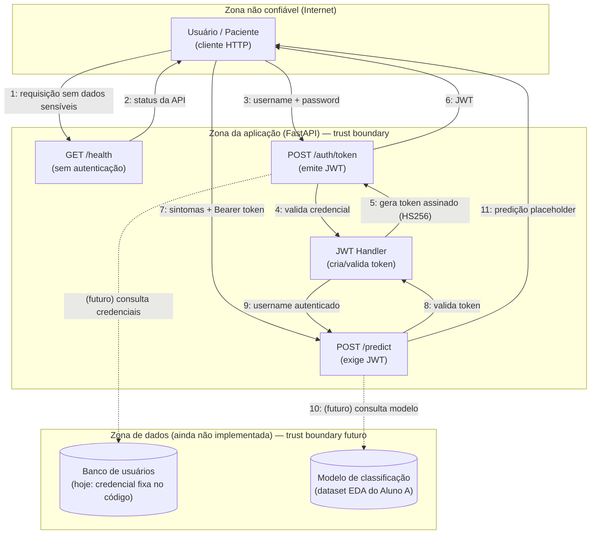

# DFD e Análise CIA — HealthAssist API

## Diagrama de Fluxo de Dados (DFD)

## Tríade CIA por componente

| Componente | Confidencialidade | Integridade | Disponibilidade |
|---|---|---|---|
| Sintomas do paciente (`PredictRequest.symptoms`) | **Alta** — dado de saúde, não pode vazar nem ser logado em texto puro | Média — não pode ser alterado entre o envio e a classificação | Média — indisponibilidade atrasa a triagem, mas não é uma emergência em si |
| Credenciais (`username`/`password`) | **Alta** — hoje trafegam e são comparadas em texto puro no código (`admin`/`senha123` fixos) | Alta — só o dono da credencial pode gerar um token válido | Baixa — indisponível não gera risco à saúde, só bloqueio de acesso |
| Token JWT | Média — não deve ser interceptável (exige HTTPS em produção) | **Alta** — se for forjado, dá acesso indevido à API | Baixa |
| `SECRET_KEY` (assinatura do JWT) | **Alta** — se vazar, qualquer um forja tokens válidos. Hoje tem valor padrão inseguro (`dev-secret-key-insecure`) caso a variável de ambiente não seja definida | **Alta** | — |
| Predição/recomendação (`PredictResponse`) | Baixa | **Alta** — uma predição adulterada pode induzir a uma conduta médica errada | **Alta** — é a função central do sistema; precisa estar sempre disponível |
| `GET /health` | Baixa — não expõe dado sensível | Baixa | **Alta** — usada por monitoramento para saber se a API está no ar |